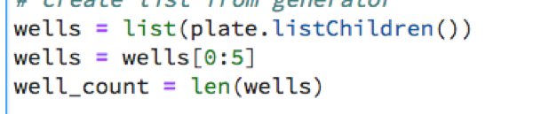
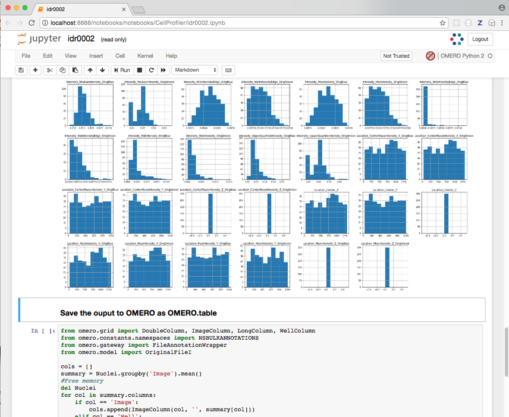
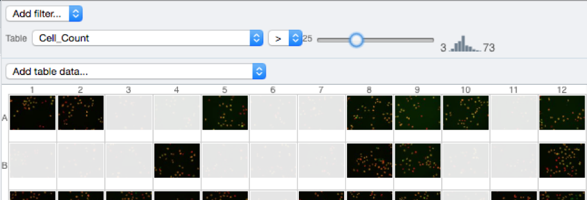

Analyze OMERO data
==================

**Description**
---------------

In this document, we will demonstrate how to integrate CellProfiler and
OMERO using the CellProfiler Python API and the OMERO Python API. We
will use a Jupyter notebook to demonstrate the integration.

We will show:

-  How to adjust an existing CellProfiler pipeline so that it can be used with OMERO.

-  How load images from a Plate using the OMERO API.

-  How to run CellProfiler using its Python API.

-  How to plot the results.

-  How to save the generated results back to OMERO as OMERO.table so they can be used later on by OMERO.parade.

**Resources**
-------------

We will use a CellProfiler example pipeline to analyse RNAi screening
data from the Image Data Resource (IDR).

-  PercentPositive Pipeline \ https://cellprofiler.org/examples/

-  IDR data \ https://idr.openmicroscopy.org/webclient/?show=screen-102

-  Notebook :download:`idr0002_save.ipynb <../notebooks/idr0002_save.ipynb>`

For convenience, the IDR data have been imported into the training
OMERO.server. This is only because we cannot save results back to IDR
which is a read-only OMERO.server.

**Step-by-Step**
----------------

#. First, open the webclient and find the Plate belonging to trainer-1 named plate1_1_013.

#. Go to \ https://mybinder.org/

#. Copy and paste the URL of this repository

#. Click launch to start the instance.

#. Look under *Notebooks* for idr0002_save.ipynb.

    .. image:: images/cp1.png

#. Select the first Step and click on the Run button to execute each step in turn.

#. For the connection to OMERO, you will be asked to enter your login details when running the OMERO credentials cell.

#. Select the plate in the webclient, find the Plate ID in the right-hand panel and copy this into the plate_id variable in the next step of the notebook.

#. The following cell loads the example pipeline and modifies it to remove the modules that are normally used for loading images from disk.

#. These modules are replaced by the InjectImage module, using numpy planes loaded from OMERO Images. This allows to pass data from OMERO to CellProfiler.

#. The pipeline is run on all 2-Channel images from each Well in the 96-well plate (each Well contains one image), generating a CSV file containing rows for different objects identified in the
image and columns for various parameters measured.

#. Note that to save time during the workshop, we can run on a subset of all Wells in the plate. We run it on the first 5 wells:

#. The generated CSV file is read into a Dataframe for each image. We add the Image ID and Well ID, as well as the total number of Objects, Cell_Count, to each Dataframe.

#. All the Dataframes are then concatenated into a single Dataframe.

#. We can visualise the data as histograms for each column with df.hist()

#. Finally, the Dataframe rows are grouped by Image to give an average value per Image of each parameter (column) in the table.

#. This data is saved back to OMERO as an HDF5-based table attached to the Plate, which can be read by other clients.

#. Return to the webclient and select the Plate named plate1_1_013_previously_analysed.

#. Select a Well in the central pane and open the Tables harmonica in the General tab in the right-hand pane. This will show all the CellProfiler values for this Well.

#. In the Thumbnails dropdown menu at the top-right of the centre panel, select the Parade plugin.

#. At the top-left of the centre panel choose *Add filter... > Table* to filter Wells by the data from CellProfiler.

#. Change the filter from ImageNumber to Cell_Count (at the bottom of the list).

#. Now you can use theslider to filter Wells by Cell Count.

