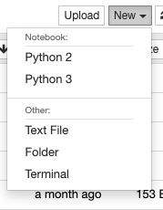

Install CellProfiler and OMERO Python bindings
==============================================

In this section, we show how to install CellProfiler in a `Conda <https://conda.io/en/latest/>`_ environment.
We will use the CellProfiler API to analyze data stored in an OMERO server.

CellProfiler currently runs on Python 2.7. It does not yet support Python 3.

**Setup**
---------

We recommend to install the dependencies using Conda.
Conda manages programming environments in a manner similar to 
`virtualenv <https://virtualenv.pypa.io/en/stable/>`_.

- Install `Miniconda <https://docs.conda.io/en/latest/miniconda.html>`_ if necessary.

- If you do not have a local copy of the `omero-guide-cellprofiler repository <https://github.com/ome/omero-guide-cellprofiler>`_, first clone the repository::

    $ git clone https://github.com/ome/omero-guide-cellprofiler.git

- Go into the directory::

    $ cd omero-guide-cellprofiler

- Create a programming environment using Conda::

    $ conda create -n cellprofiler python=2.7

- Install CellProfiler, its dependencies and ``omero-py`` in order to connect to an OMERO server using an installation file::

    $ conda env update -n cellprofiler --file binder/environment.yml 

- Activate the environment::

    $ conda activate cellprofiler

Alternatively you can create a local Docker Image using ``repo2docker``, see :download:`README.md <https://github.com/ome/omero-guide-cellprofiler/blob/master/README.md>`::

    $ repo2docker .

When the Image is ready:

- Copy the URL displayed in the terminal in your favorite browser

- Click the ``New`` button on the right-hand side of the window

- Select ``Terminal``

- A Terminal will open in a new Tab

- A Conda environment has already been created when the Docker Image was built

- To list all the Conda environment, run::

    $ conda env list

- The environment with CellProfiler and the OMERO Python bindings is named ``kernel``, activate it::

    $ conda activate kernel
